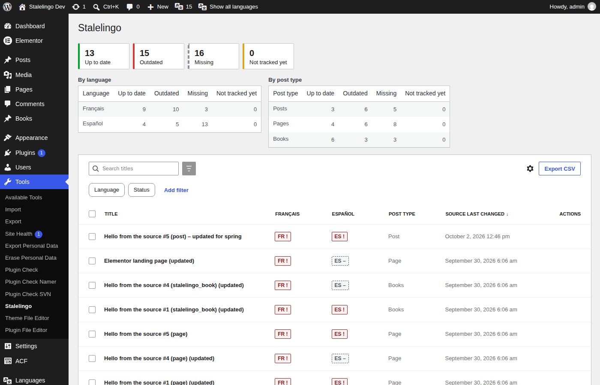

# Stalelingo

Stalelingo is a WordPress plugin that tells you which translations went out of date when the source post changed, and shows exactly what changed. It works with Polylang (including the free version) and WPML.



## What it does

When the source version of a post is edited, its translations silently go stale. Stalelingo fingerprints the source content each time a translation is marked as up to date. When the source changes later, it flags every affected translation as outdated and shows a field-by-field diff.

It tracks:

- Title, content, excerpt, and optionally the slug and featured image.
- Custom fields you choose, including ACF fields set to be translated and text inside ACF blocks.
- Visible Elementor text. Styling-only changes are ignored.

Formatting-only edits, such as whitespace or block attribute changes, are ignored unless you turn on strict mode.

## Where you see it

- A dashboard under **Tools → Stalelingo** with a matrix of posts and languages, filters, bulk actions and CSV export.
- A status column in the post lists, with one badge per language.
- A panel in the block editor, and a metabox in the classic editor, with the diff and a **Mark as up to date** button.
- An admin bar counter, and daily or weekly email digests for each translator.
- WP-CLI: `wp stalelingo report`, `mark-synced`, `baseline` and `recalc`.
- A REST API under `stalelingo/v1`.

Stalelingo is free. It has no paid version, no license key and no tracking, and it makes no external requests.

## Requirements

- WordPress 6.8 or newer
- PHP 8.1 or newer
- Polylang or WPML, active on the site

## Installation

Build the plugin zip and upload it under **Plugins → Add New → Upload Plugin**:

```sh
make zip    # writes dist/stalelingo-<version>.zip
```

After activating, go to **Settings → Stalelingo** and choose the post types and fields to track. Stalelingo then builds a baseline in the background and treats every existing translation as up to date.

The user-facing documentation, including the FAQ, is in [`readme.txt`](readme.txt). Changes are listed in [`CHANGELOG.md`](CHANGELOG.md).

## Development

Requires Docker (Compose v2) and `make`. Everything else runs in containers.

```sh
cp .env.example .env     # optional
make up && make setup    # http://localhost:8080/wp-admin (admin / password), Mailpit on :8025
make help                # all targets
```

`make setup PROVIDER=wpml` uses WPML when its zips are in `./private/wpml/` (git-ignored); `make test-integration PROVIDER=wpml` runs the integration suite against WPML.

| Check | Command |
|---|---|
| Coding standards, ESLint, TypeScript, Stylelint | `make lint` |
| Static analysis / PHP compatibility | `make phpstan`, `make phpcompat` |
| Tests | `make test-unit`, `make test-integration`, `make test-js`, `make test-e2e`, `make test` |
| Coverage gate | `make coverage` |
| WordPress.org package | `make zip`, `make plugin-check`, `make readme-validate` |

## License

GPL-2.0-or-later.
